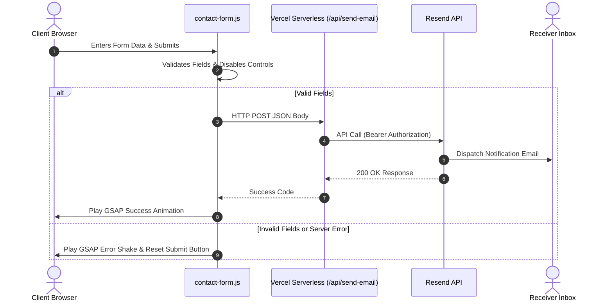

# ⚡ RARE DEVS // GRIDFOLIO

> A high-performance, cyberpunk-inspired professional engineering studio portfolio. Engineered with advanced serverless architectures, custom vector graphics, state-of-the-art scroll interfaces, and a 100% graded SEO matrix.

---

## 💎 Project Badges


---

## 🛠️ The Technology Stack Matrix

We code in robust languages, build on modern frameworks, and deploy on resilient cloud systems:

* **Core Languages:** HTML5, CSS3, Java, JavaScript, Python, TypeScript, Rust, C++, C#, PHP
* **Frameworks & Runtimes:** Next.js, Django, Go (Golang), NestJS, Node.js, Flask API, React, Vue.js, Svelte
* **Databases & DevOps:** PostgreSQL, MySQL, MongoDB, Redis, Docker, AWS, Google Cloud, CI/CD Pipeline
* **Design Systems:** Tailored Grid Layouts, Tailwind CSS, Custom SVG Iconography, UI/UX

---

## 🚀 Key Architectural Features

### 1. Secure Serverless Mail Routing
We replaced outdated form templates with a fully secure, serverless backend. Client submissions are validated in the DOM, then dispatched to a Vercel serverless Node.js helper that forwards the body to your Resend Inbox.
* **Backend Endpoint:** [`api/send-email.js`](file:///c:/Users/user/Desktop/GridFolio/api/send-email.js)
* **Frontend Controller:** [`js/contact-form.js`](file:///c:/Users/user/Desktop/GridFolio/js/contact-form.js)
* **UI Micro-Animations:** Custom GSAP spring physics handles success modals, while an error states trigger structural orange-red input glows and directional shake alerts.



### 2. Bespoke Dynamic Carousel (30 Technology Slots)
The Fieldwork Routine slider on the About page is a responsive vector gallery displaying 30 detailed technology nodes.
* **Math-driven Scaling:** The CSS sets `width: max-content` and dynamically computes card sizes (`380px` desktop / `80vw` mobile).
* **Scroll-translation Bounds:** The GSAP animation controller calculates container boundary width in real-time (`-(wrapperWidth - containerWidth)`), ensuring clean scroll performance across any screen ratio.
* **Iconography:** Hand-coded, inline, scalable vector SVGs utilizing the site's design system color variables.

### 3. SEO Crawler Optimization
* **Structured JSON-LD:** Tailored schema markers on all pages mapping services, portfolio collections, business location details, and active social media accounts.
* **Indexation Rules:** Structured [`public/sitemap.xml`](file:///c:/Users/user/Desktop/GridFolio/public/sitemap.xml) and [`public/robots.txt`](file:///c:/Users/user/Desktop/GridFolio/public/robots.txt) rules directing crawler paths.
* **Link Matrix:** Page titles, meta descriptions, canonical targets, and social cards (Open Graph / Twitter) updated across all layouts.

---

## 💻 Running the Matrix Locally

Follow these commands to deploy, test, or modify GridFolio:

### 1. Prerequisites
Ensure you have [Node.js](https://nodejs.org/) (v18+) and [pnpm](https://pnpm.io/) installed.

### 2. Installation
Clone the repository and install all dependencies:
```bash
pnpm install
```

### 3. Start Development Server
Boot up the local Vite hot-reload server:
```bash
pnpm dev
```

### 4. Build Production Bundle
Compile assets, optimize HTML nodes, and bundle styles:
```bash
pnpm build
```

---

## 🌐 Production Deployment

The project is designed to be hosted on **Vercel** for automatic serverless routing:

1. Link your GitHub/GitLab repository to **Vercel**.
2. Set the following **Environment Variables** in the Vercel Dashboard:
   * `RESEND_API_KEY`: Your authorization key from the Resend Dashboard.
   * `CONTACT_RECEIVER_EMAIL`: The recipient email address for form submissions.
3. Deploy! Vercel will automatically build the site using Vite and expose the serverless routing on `/api/send-email`.

---

<div align="center">
  <sub>Engineered by <strong>Rare Devs</strong>. Built for performance.</sub>
</div>
